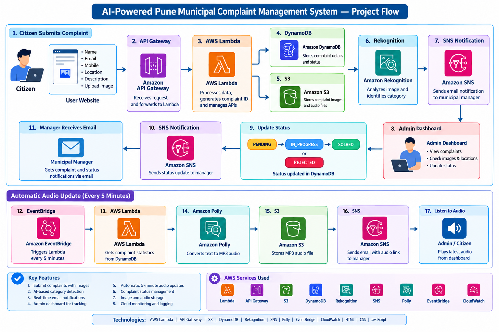

# AI-Powered Pune Municipal Complaint Management System

An AWS-based municipal complaint management system that allows citizens to submit complaints and provides a dashboard for administrators to view, filter, and update complaint status.

## Project Overview

The project contains two web interfaces:

- **Citizen Complaint Portal** — citizens submit their name, mobile number, email, complaint location, description, and an image.
- **Admin Dashboard** — administrators view complaints, images, locations, categories, statuses, statistics, and the latest municipal audio update.

The frontend communicates with AWS API Gateway endpoints. Complaint data is processed through AWS services such as Lambda, DynamoDB, S3, Rekognition, SNS, Polly, EventBridge, and CloudWatch as represented in the project flow.

## Architecture / Project Flow



## AWS Services Used

- AWS Lambda
- Amazon API Gateway
- Amazon S3
- Amazon DynamoDB
- Amazon Rekognition
- Amazon SNS
- Amazon Polly
- Amazon EventBridge
- Amazon CloudWatch

## Technologies

- HTML
- CSS
- JavaScript
- AWS Cloud Services

## Main Features

- Citizen complaint submission
- Complaint image upload
- Complaint ID generation
- AI-based image/category analysis using Amazon Rekognition
- Complaint storage using DynamoDB
- Image and audio storage using S3
- Admin complaint dashboard
- Search and filtering
- Complaint status management
- Email notifications through SNS
- Automatic municipal audio updates
- Responsive citizen and admin interfaces

## Complaint Status

- PENDING
- IN_PROGRESS
- SOLVED
- REJECTED

## Project Files

```text
ai-pune-municipal-complaint-management-system/
├── index.html
├── complaints_management.html
├── project-flow.png
├── README.md
└── .gitignore
```

## How the Citizen Portal Works

1. Citizen opens the complaint portal.
2. Citizen enters personal and complaint information.
3. Citizen uploads a problem image.
4. The frontend sends the complaint data to the API Gateway endpoint.
5. The API returns a complaint ID and an S3 upload URL.
6. The image is uploaded using the returned upload URL.
7. The successful complaint ID is displayed to the citizen.

## How the Admin Dashboard Works

1. The dashboard loads complaint data from the API.
2. Complaint statistics are calculated and displayed.
3. Administrators can search and filter complaints.
4. Administrators can view complaint images and details.
5. Administrators can change complaint status.
6. The dashboard can load the latest municipal audio update.

## Important Security Note

This repository contains frontend API endpoint URLs because they are used by the browser application. Do **not** add AWS access keys, secret keys, passwords, private certificates, `.env` files, or other credentials to this repository.

If the backend API endpoints are no longer intended for public use, update or remove them before publishing the project.

## Future Improvements

- Authentication and role-based access control
- Advanced analytics
- Real-time complaint tracking
- Mobile application
- Additional AI classification capabilities


